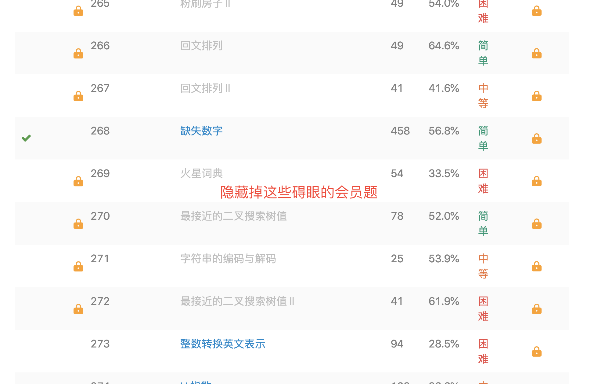

# [leetcode 去广告chrome插件](https://github.com/weiyinfu/lecodead)

* lecodead=leetcode+dead
* dead=de+ad，意为去广告

leetcode是一个好网站，然而广告有点太显眼了，物极必反，故有此repo。

# 使用方式
* 打开"chrome/设置/扩展程序/"
* 点击右上角的"开发者模式"，选择左上角的加载已解压的程序。（之所以这么操作是因为chrome只允许用户安装来自于chrome应用商店的正版扩展程序）
* 选择本文件所在的文件夹。

# 功能简介
* 我不当会员

* 隐藏掉碍眼的vip题目   

* 显示做题进度   

